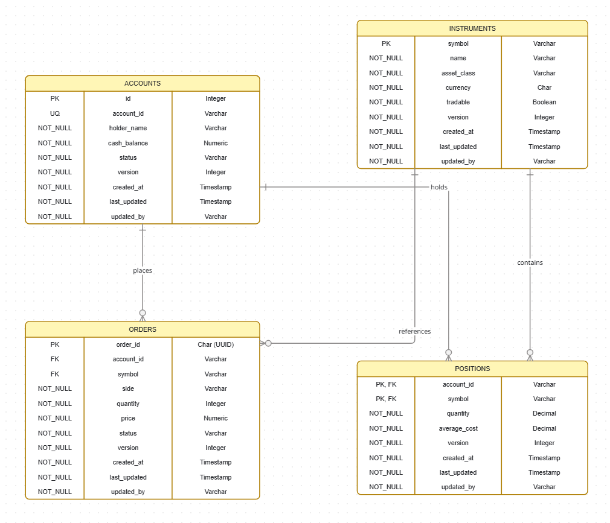

# The UnderFrogs - Team Project

## Team Members
- Marco Nocerino
- David Jayakumar
- Shane Ginty
- Jamie Montgomery

## Links
[Jira Board](https://underfrog.atlassian.net/?continue=https%3A%2F%2Funderfrog.atlassian.net%2Fwelcome%2Fsoftware%3FprojectId%3D10000&atlOrigin=eyJpIjoiNGY4NzRlNDY5N2I4NDUwYmI3NDFjYjY2ZGUyYWRmMDUiLCJwIjoiamlyYS1zb2Z0d2FyZSJ9)


## Entity Relationship Diagram
Shows the database schema and relationships between the `accounts`, `instruments`, `orders`, and `positions` tables.



## Docker Setup
The project ships with a `docker-compose.yml` that spins up Postgres and the app together.

1) Create a `.env` file in the project root (this is gitignored, so it won't be committed):
```
POSTGRES_DB=underfrog
POSTGRES_USER=postgres
POSTGRES_PASSWORD=<your-password>
```
2) Start the stack:
```
docker-compose up -d
```
This creates two containers, `underfrog-postgres` and `underfrog-app`, and a named volume `postgres_data` (persisted as `<project>_postgres_data`) for the database files. The schema in `sql/tables.sql` is run automatically on first init via `/docker-entrypoint-initdb.d`.

3) Check the containers are up:
```
docker ps
```
If `docker-compose up -d` fails with a port conflict on 5432, another Postgres container is already using it. Find and stop it:
```
docker ps
docker stop <container_name>
```

4) Connect to the database inside the container:
```
docker exec -it underfrog-postgres psql -U postgres -d underfrog
```

5) Tear down (add `-v` to also delete the data volume):
```
docker-compose down
docker-compose down -v   # also wipes the postgres_data volume
```

> Note: `sql/dummy-data.sql` is **not** currently auto-loaded by Docker init. To seed sample data, run it manually after the container is up:
> ```
> docker exec -i underfrog-postgres psql -U postgres -d underfrog < sql/dummy-data.sql
> ```

## Database Setup (manual / non-Docker)
1) Create the database (note: underscores, not hyphens, since Postgres identifiers can't contain `-` unquoted):
```
psql -U postgres -h <host> -p 5432 -c "CREATE DATABASE enterprise_schema;"
```
2) Create the schema (tables):
```
psql -U postgres -h <host> -p 5432 -d enterprise_schema -f sql/tables.sql
```
3) Load the seed/dummy data:
```
psql -U postgres -h <host> -p 5432 -d enterprise_schema -f sql/dummy-data.sql
```

## Branching Strategy (GitFlow)
### Purpose
Our project follows a GitFlow-style branching model to keep development organized, support parallel feature work, and maintain stability.

## Core Branches
**main**
Production-ready code only. Every commit here should be deployable.
**develop**
Integration branch for completed features. This is the default branch for ongoing development.
**Supporting Branches**
feature/<short-description>
Created from develop for new features and improvements

## Workflow
1) **Start Feature Work**
Create a new feature branch from develop.
Keep commits focused and descriptive.
Rebase or merge develop regularly to stay up to date.

3) **Open Pull Request**
Open a pull request from feature/<short-description> into develop.

5) **Code Review Requirements**
At least 1 approved review is required before merge.
No direct pushes to main.
Resolve all review comments before merging.

4) **Merge Strategy**
Use squash merge for feature branches to keep history clean.
Delete feature branch after merge
