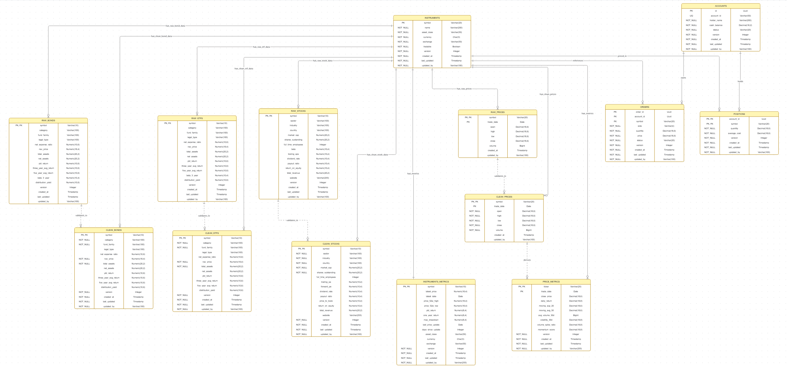

# The UnderFrogs - Team Project

## Team Members
- Marco Nocerino
- David Jayakumar
- Shane Ginty
- Jamie Montgomery

## Links
[Jira Board](https://underfrog.atlassian.net/?continue=https%3A%2F%2Funderfrog.atlassian.net%2Fwelcome%2Fsoftware%3FprojectId%3D10000&atlOrigin=eyJpIjoiNGY4NzRlNDY5N2I4NDUwYmI3NDFjYjY2ZGUyYWRmMDUiLCJwIjoiamlyYS1zb2Z0d2FyZSJ9)


## Entity Relationship Diagram



## Docker Setup
1) Create a `.env` for each service from its example (these are gitignored, never commit them):
```
for s in accounts-service instruments-service orders-service positions-service trade-executor trade-analytics-service; do
  cp app/$s/.env.example app/$s/.env
done
```
Then fill in the database passwords and use the **same** `JWT_SECRET` in every file.

| File | Needed for |
|---|---|
| `app/accounts-service/.env`, `instruments-service`, `orders-service`, `positions-service` | Required |
| `app/trade-executor/.env` | Optional (defaults work; add your own Alpaca paper keys for live prices) |
| `app/trade-analytics-service/.env` | Optional (only for the analytics service) |

2) Build the jars and start the core stack (waits until every service is healthy):
```
for s in accounts-service instruments-service orders-service positions-service trade-executor; do
  mvn -B -f app/$s/pom.xml clean package -Dmaven.test.skip=true
done
docker-compose up -d --build --wait accounts-service instruments-service orders-service positions-service trade-executor kafka-ui
```

3) Load the market data (daily closes the trade executor falls back to):
```
docker-compose up -d python trade-analytics-db
./db/scripts/setup-pipeline.sh populate   # also starts trade-analytics-service

```

| Service | Host port |
|---|---|
| accounts-service | 8081 |
| instruments-service | 8082 |
| orders-service | 8083 |
| positions-service | 8084 |
| python dashboard | 8085 |
| kafka-ui | 8086 |
| kafka (external listener) | 127.0.0.1:9094 |
| accounts / instruments / orders / positions / analytics DBs | 127.0.0.1:5433-5437 |

Sprint 7 environment variables:

| Variable | Service | Purpose |
|---|---|---|
| `KAFKA_BOOTSTRAP_SERVERS` | orders-service, trade-executor | Kafka broker, `kafka:9092` inside compose |
| `JWT_SECRET` | all Java services | Shared signing secret, must match everywhere |
| `SERVICE_TOKEN_TTL` | trade-executor | Lifetime of its service-to-service token |
| `ALPACA_KEY_ID`, `ALPACA_SECRET_KEY` | trade-executor | Your own Alpaca paper keys; blank = daily close only |
| `MARKET_DATA_POLL_INTERVAL_MS` | trade-executor | How often quotes are polled for `market-data` |
| `ETL_INTERVAL_SECONDS` | trade-analytics-service | How often the analytics ETL runs |

4) Watch the Kafka topics (or open kafka-ui on port 8086):
```
docker exec kafka /opt/kafka/bin/kafka-console-consumer.sh --bootstrap-server localhost:9092 --topic trade-events --from-beginning
```

5) Run the end-to-end smoke test (builds, starts, places a BUY, checks the fill, cash, position and `ORDER_FILLED` event, then tears down):
```
./scripts/smoke-test-e2e.sh
```
Set `KEEP_UP=true` to leave the stack running afterwards.

6) Tear down (add `--volumes` to also wipe the databases):
```
docker-compose down
docker-compose down --volumes
```

> If a service fails with `Schema-validation: missing table`, its database volume was created from an older schema. Wipe it with `docker-compose down --volumes` and start again.

## Database Setup (manual / non-Docker)
1) Create the database (note: underscores, not hyphens, since Postgres identifiers can't contain `-` unquoted):
```
psql -U postgres -h <host> -p 5432 -c "CREATE DATABASE enterprise_schema;"
```
2) Create the schema (tables):
```
psql -U postgres -h <host> -p 5432 -d enterprise_schema -f sql/tables.sql
```
3) Load the seed/dummy data:
```
psql -U postgres -h <host> -p 5432 -d enterprise_schema -f sql/dummy-data.sql
```

## Branching Strategy (GitFlow)
### Purpose
Our project follows a GitFlow-style branching model to keep development organized, support parallel feature work, and maintain stability.

## Core Branches
**main**
Production-ready code only. Every commit here should be deployable.
**develop**
Integration branch for completed features. This is the default branch for ongoing development.
**Supporting Branches**
feature/<short-description>
Created from develop for new features and improvements

## Workflow
1) **Start Feature Work**
Create a new feature branch from develop.
Keep commits focused and descriptive.
Rebase or merge develop regularly to stay up to date.

3) **Open Pull Request**
Open a pull request from feature/<short-description> into develop.

5) **Code Review Requirements**
At least 1 approved review is required before merge.
No direct pushes to main.
Resolve all review comments before merging.

4) **Merge Strategy**
Use squash merge for feature branches to keep history clean.
Delete feature branch after merge


## SonarQube quality gate

Jenkins analyzes the five Java services as separate SonarQube projects and waits for each project’s quality gate before continuing. The `Quality Gate - <service>` stages abort the pipeline when a gate fails. JaCoCo XML reports are generated during the unit-test stage and imported by the matching Sonar analysis.

For local SonarQube, the optional Compose profile avoids starting a second server during the normal application startup:

```bash
docker-compose --profile quality up -d sonarqube
```

The default local URL is `http://localhost:9001` (override it with `SONARQUBE_PORT`). Complete the first-run setup, create an analysis token, and use the server’s **Sonar way** quality gate or create a project gate with these conditions on new code:

- Blocker issues greater than 0: fail.
- Critical issues greater than 0: fail.
- Security hotspots reviewed below 100%: fail.
- Coverage below 80%: fail.
- Duplicated lines above 3%: fail.

Review any security hotspots that Sonar reports; a hotspot is a prompt for human review, not automatically a vulnerability.

Configure Jenkins under **Manage Jenkins → System → SonarQube installations** with installation name `SonarQube`, the reachable server URL, and a Jenkins **Secret text** credential containing the token. The pipeline uses `withSonarQubeEnv('SonarQube')`. Add a SonarQube webhook to `<JENKINS_URL>/sonarqube-webhook/`; `waitForQualityGate` needs that webhook to return the result and block/fail the build.

To run an analysis locally, first test the service so JaCoCo writes the XML report, then provide the host and token through environment variables (do not commit the token):

```bash
export SONAR_HOST_URL=http://localhost:9001
export SONAR_TOKEN='<your SonarQube token>'
mvn -B -f app/accounts-service/pom.xml clean verify sonar:sonar \
  -Dsonar.host.url="$SONAR_HOST_URL" -Dsonar.token="$SONAR_TOKEN" \
  -Dsonar.projectKey=theunderfrogs-accounts-service
```

Repeat with the matching service POM and key: `theunderfrogs-instruments-service`, `theunderfrogs-orders-service`, `theunderfrogs-positions-service`, and `theunderfrogs-trade-executor`.

## Local security scans

These scans are run locally before opening a PR. Keep their reports outside the repository and attach the sanitized reports to the PR. Review all high and critical findings; fix them or record a specific, justified “won’t fix” decision. Dependency-Check uses the NVD API, so set `NVD_API_KEY` to a personal NVD API key to avoid slow updates and rate limiting.

### SAST: SpotBugs with FindSecBugs

The service POMs configure SpotBugs and the FindSecBugs security detectors. This command writes XML findings under each service’s `target/spotbugsXml.xml`:

```bash
for service in accounts-service instruments-service orders-service positions-service trade-executor; do
  mvn -B -f "app/$service/pom.xml" clean verify \
    com.github.spotbugs:spotbugs-maven-plugin:4.10.3.0:spotbugs
done
```

### Dependency scanning: OWASP Dependency-Check

This generates HTML, JSON, and SARIF reports for each service in `/tmp/underfrogs-security-reports`:

```bash
mkdir -p /tmp/underfrogs-security-reports
for service in accounts-service instruments-service orders-service positions-service trade-executor; do
  mvn -B -f "app/$service/pom.xml" \
    org.owasp:dependency-check-maven:12.2.2:check \
    -Dformat=ALL \
    -DnvdApiKey="${NVD_API_KEY:-}" \
    -Dodc.outputDirectory="/tmp/underfrogs-security-reports/$service"
done
```

### Secret detection: Gitleaks over history and working tree

The history scan includes all locally available refs. The separate directory scan checks current, uncommitted files. Gitleaks redacts secrets in its output and reports:

```bash
docker run --rm -v "$PWD:/repo:ro" -v "/tmp/underfrogs-security-reports:/reports" \
  zricethezav/gitleaks:v8.30.1 git --config=/repo/.gitleaks.toml \
  --log-opts="--all" \
  --report-format sarif --report-path=/reports/gitleaks-history.sarif \
  --redact=100 /repo

mkdir -p /tmp/underfrogs-gitleaks-tree /tmp/underfrogs-security-reports
git ls-files -co --exclude-standard -z \
  | tar --null -T - -cf - \
  | tar -xf - -C /tmp/underfrogs-gitleaks-tree
docker run --rm -v "/tmp/underfrogs-gitleaks-tree:/repo:ro" \
  -v "/tmp/underfrogs-security-reports:/reports" \
  zricethezav/gitleaks:v8.30.1 dir --config=/repo/.gitleaks.toml \
  --report-format sarif --report-path=/reports/gitleaks-working-tree.sarif \
  --redact=100 /repo
```

A secret found in Git history must be treated as exposed: rotate it, remove it from current files, and coordinate any history rewrite with the repository owners. A scan report is evidence of the scan, not a substitute for rotating exposed credentials.

### Reviewed scan findings

Local SpotBugs/FindSecBugs review (2026-09-30) found one priority-1 rule in each of accounts, instruments, orders, and positions: `SPRING_CSRF_PROTECTION_DISABLED`. These services are stateless OAuth2 resource servers that accept bearer JWTs and do not authenticate with browser cookies or server sessions, so CSRF protection is intentionally disabled; the finding is documented as a justified exception. Trade Executor had no priority-1 security finding.

The same scan reported `CRLF_INJECTION_LOGS` in `InstrumentService.deleteInstrument`. The warning no longer logs the user-controlled instrument symbol. The follow-up SpotBugs run no longer reports `CRLF_INJECTION_LOGS`; the service tests pass.

The full available Git history scan reported one `generic-api-key` match at `OrderControllerMvcIntegrationTest.java:127`, on the `idempotencyKey` field of a test request. This is test idempotency data, not an authentication credential. `.gitleaks.toml` contains a narrow path-and-line allowlist for that reviewed false positive. Review it again if that fixture changes. The working-tree command scans a snapshot of tracked and non-ignored files, so it excludes ignored local `.env` files and generated `target` test reports.
