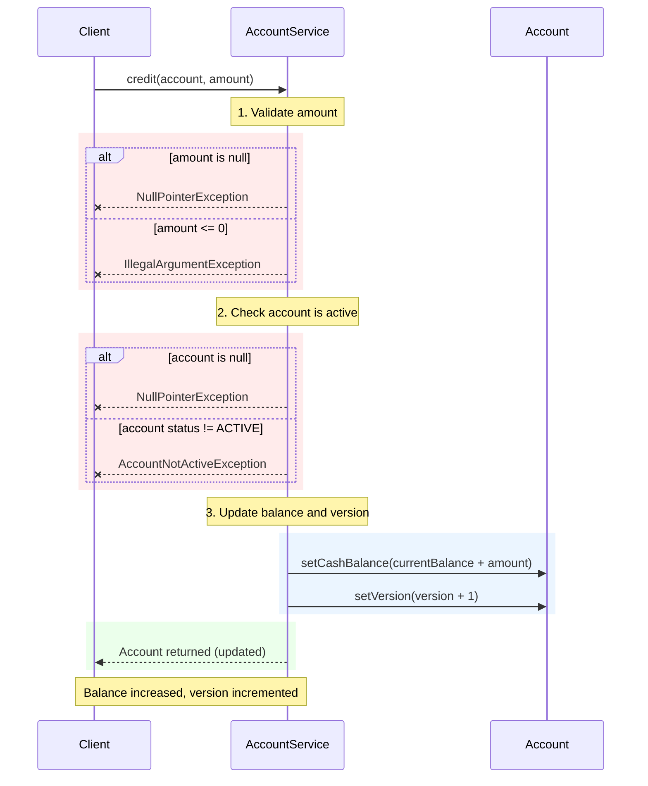
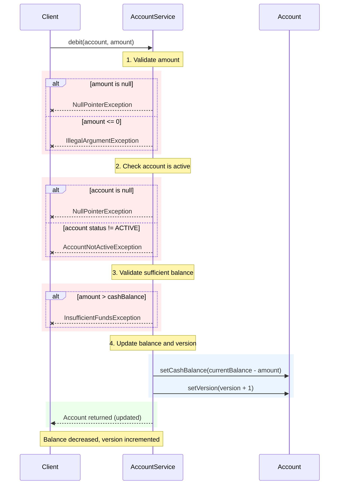

# Account Management – UML Sequence Diagram

Comprehensive sequence diagram tracing `AccountService.credit()` and `AccountService.debit()` operations. Shows validation checkpoints, state updates, and exception paths for account cash balance management.

The flow validates in strict sequence — validation stops immediately on first failure. Only successful validation leads to balance update and version increment.

## Credit Operation Flow

## Debit Operation Flow

