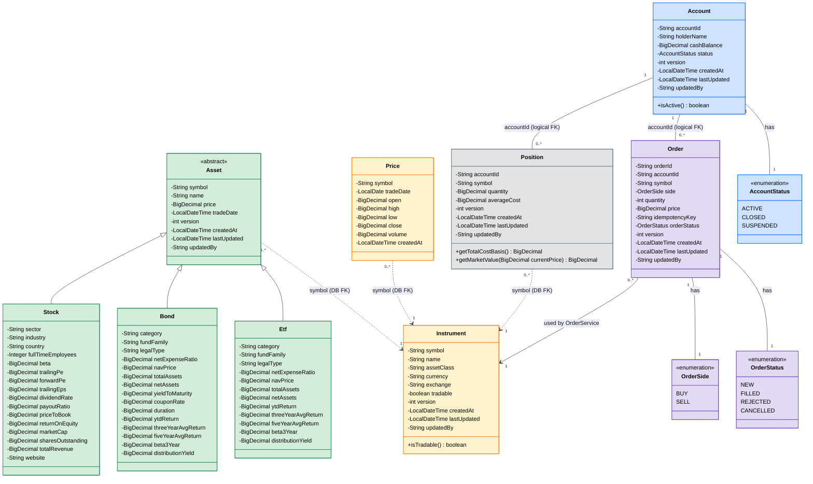

# Domain Model – UML Class Diagram

No model class here holds a direct object reference to another — all
relationships are joined by matching ID fields (`accountId`, `symbol`), not
Java fields. Solid line (`Order → Instrument`) is enforced in both the DB and
in Java (`OrderService`/`OrderValidationService`). Dashed lines
(`Position`/`Price`/`Asset` → `Instrument`) are enforced by a DB foreign key
only — nothing in the Java code checks them yet.

