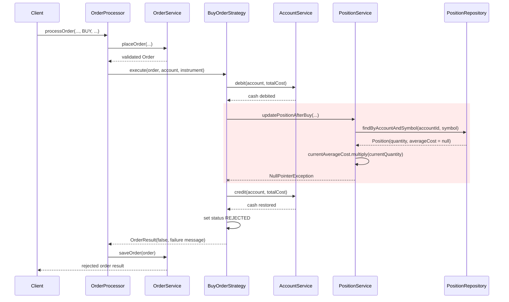

# Buy Order Execution Failure - UML Sequence Diagram

This edge case shows a `BUY` order that passes validation but fails because an
existing position has a corrupted `null` average cost. The resulting
`NullPointerException` occurs during the position cost calculation. The
`BuyOrderStrategy` reverses the cash debit, marks the order `REJECTED`, and
returns a failed result. `Client` is illustrative because production code does
not currently call this flow.

