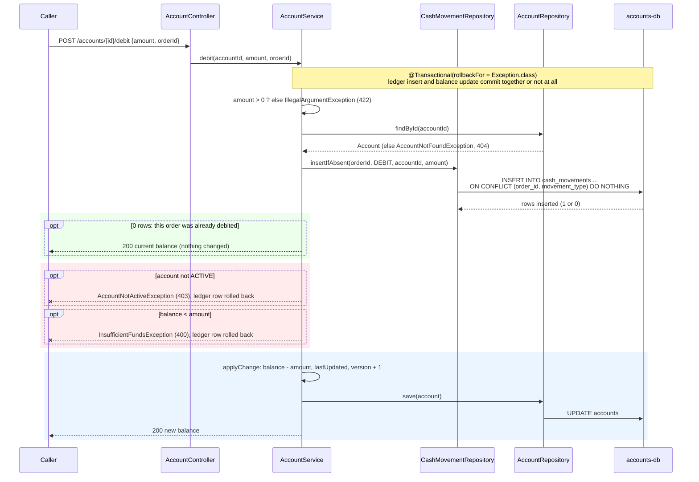
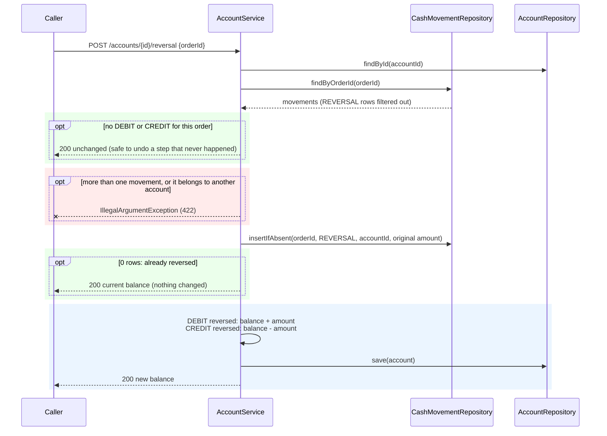
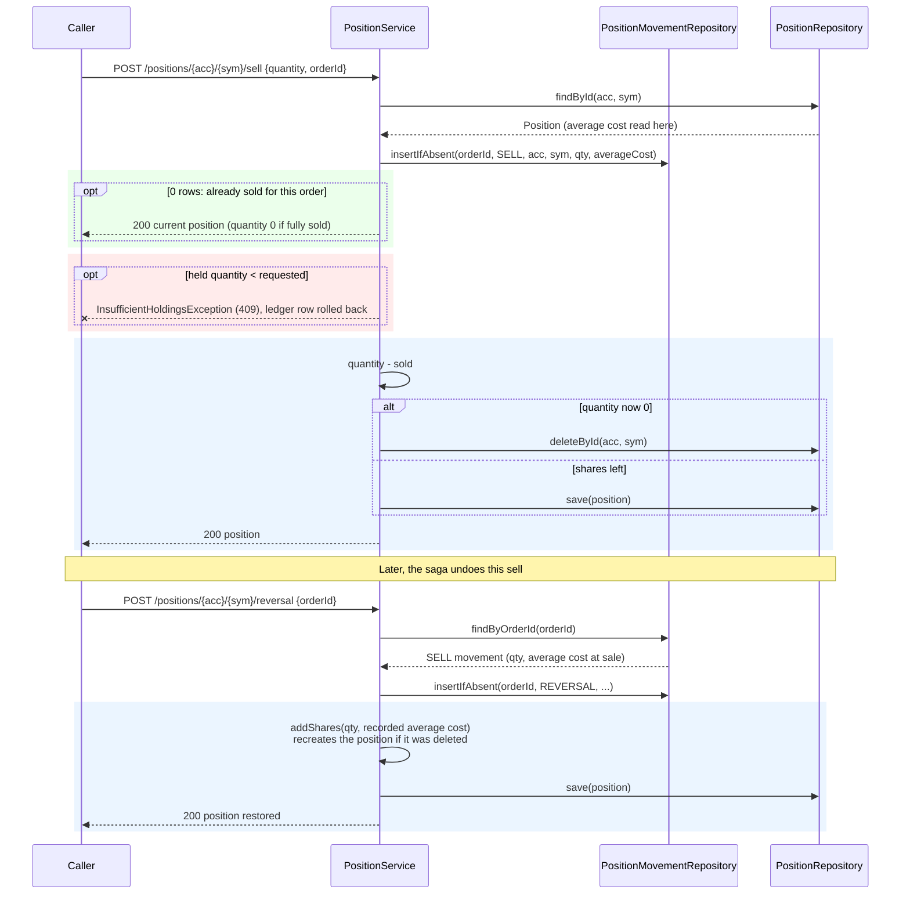
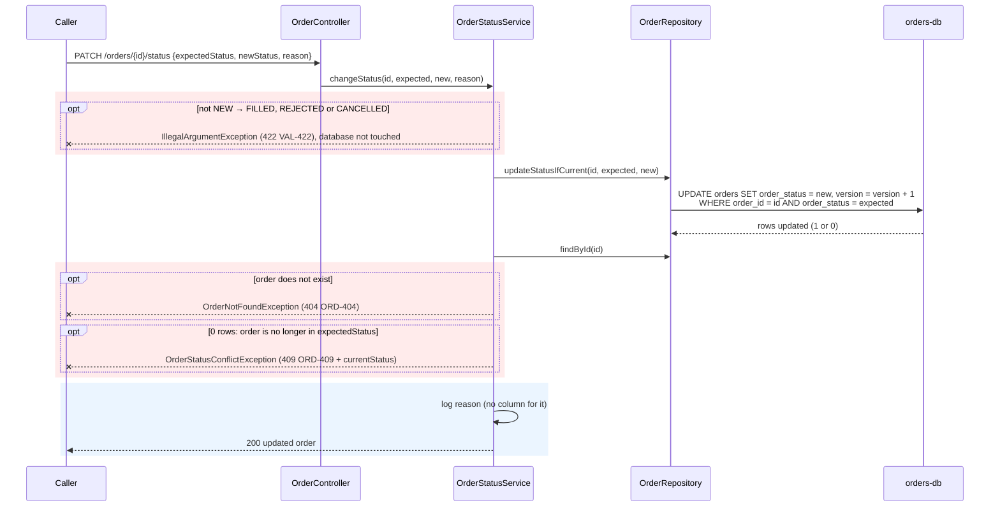
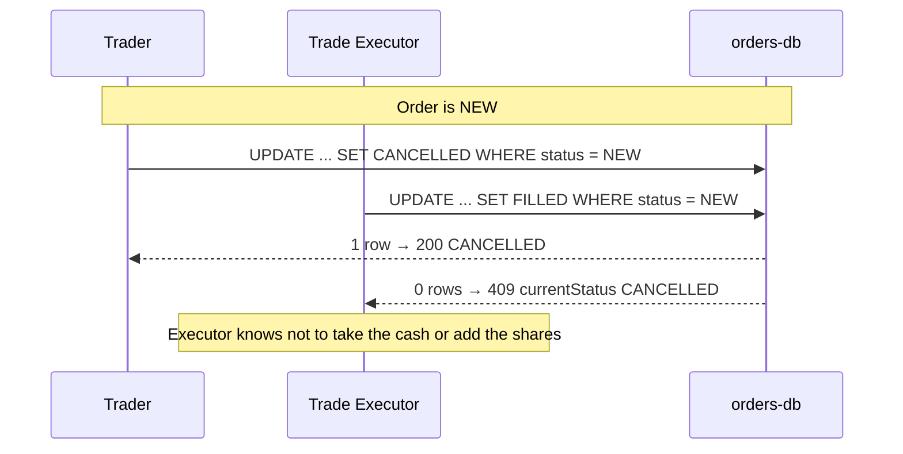
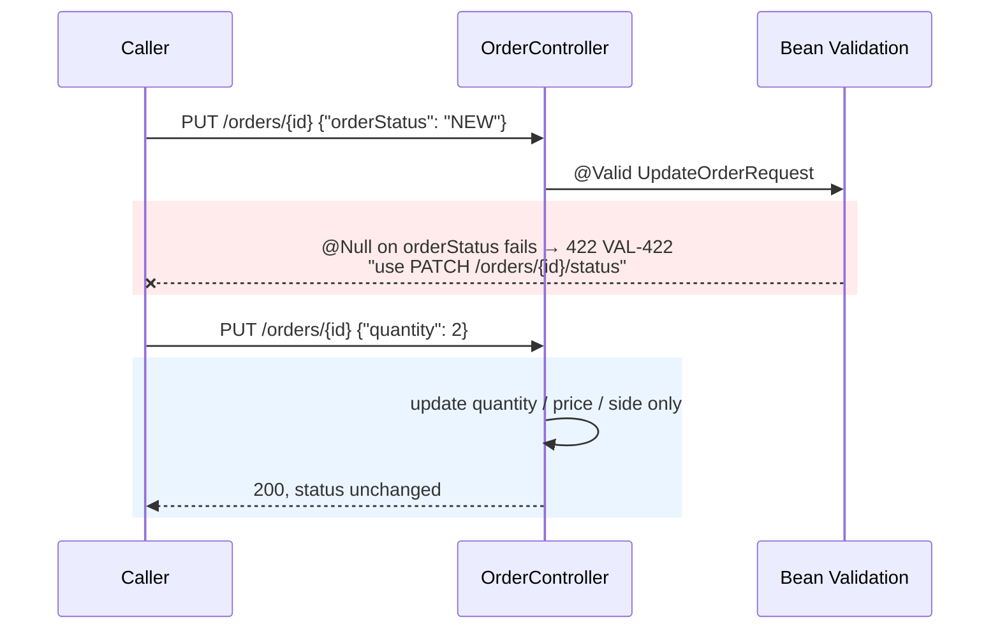
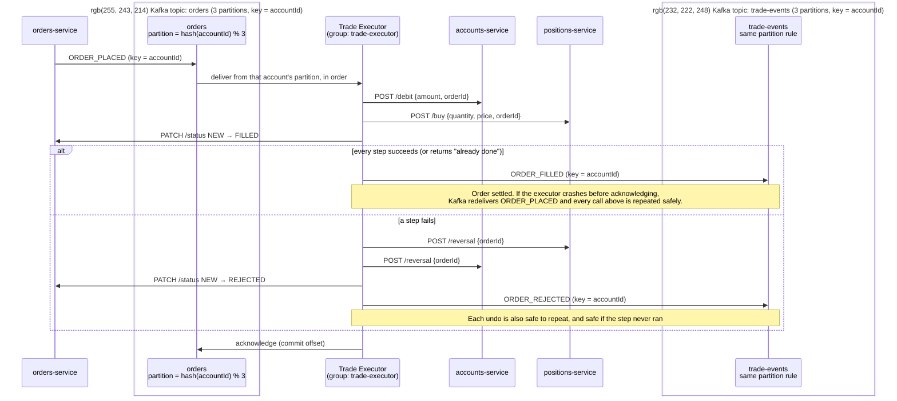
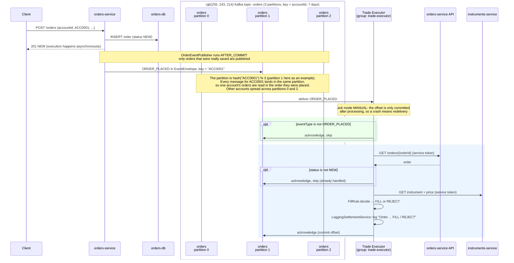
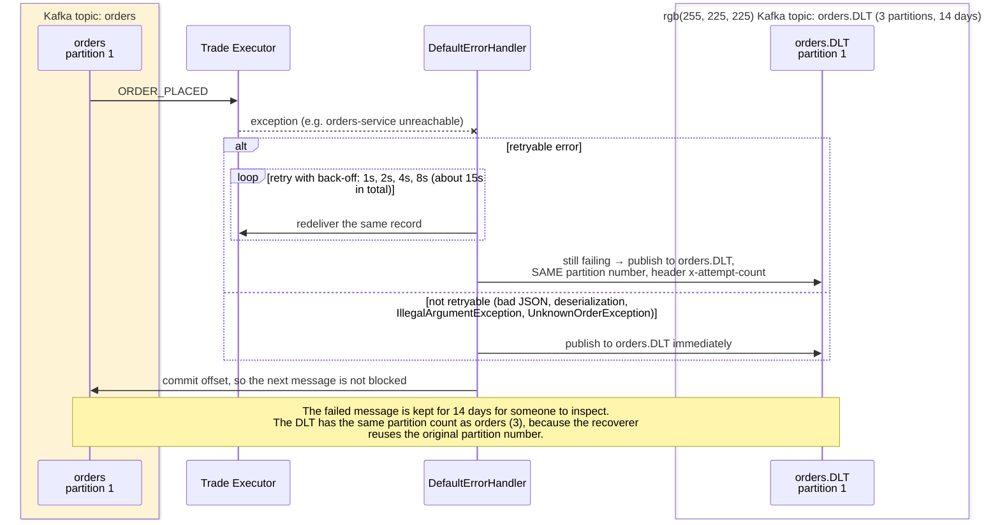
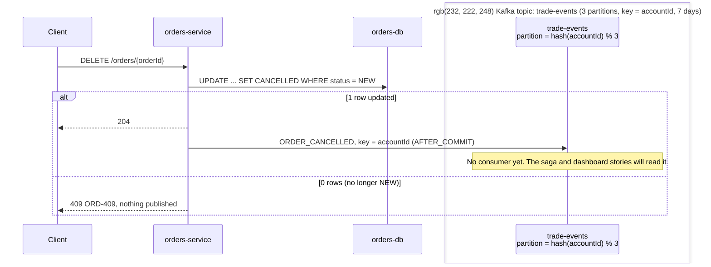

# Idempotent Writes – UML Sequence Diagrams

Traced from the `feature/idempotentWrites` branch. These are the endpoints the
Trade Executor will call when it settles an order. Each one is now safe to
repeat: called twice with the same `orderId`, it changes the data once.

Cash lives in accounts-db, positions in positions-db and orders in orders-db,
so the three writes can't share one transaction. Each service makes its own
write safe to repeat instead, and the saga story (S7-5) will chain them.

`Caller` is the Trade Executor (service token, role `SERVICE`) or an
authenticated user. Nothing calls these flows automatically yet.

Colour key: blue = normal path, green = repeat (nothing changes),
red = rejected or rolled back.
Kafka topics (diagrams 6 and 7): yellow box = `orders`, purple box =
`trade-events`, red box = `orders.DLT`. All topics have 3 partitions.

---

## 1. Debit / credit with an orderId (accounts-service)

`AccountService.debit(accountId, amount, orderId)`. Credit is the same shape,
with `MovementType.CREDIT` and no funds check.

Without an `orderId`, `isRepeat` returns false and no ledger row is written:
the call behaves exactly as before (every call is applied).

The ledger check runs **before** the funds check. Otherwise a repeated debit
would fail with "insufficient funds", because the first call already lowered
the balance.

---

## 2. Reversal (accounts-service)

`AccountService.reverse(accountId, orderId)`. Used by the saga to undo a step.

No `ACTIVE` check on a reversal: undoing a step must still work if the account
was suspended in between.

---

## 3. Buy / sell / reversal (positions-service)

`PositionService.updatePositionAfterBuy/Sell(..., orderId)` and `reverse(...)`.
Same pattern as accounts, with one extra rule: the ledger stores a `price` for
every movement, so a reversal can restore the cost basis.

| Movement | `price` stored in the ledger |
|---|---|
| BUY | The purchase price |
| SELL | The position's average cost at the moment of the sale |

Reversing a **buy** works the other way: `removeShares` takes the shares and
their cost out of the average, deletes the position if nothing is left, and
returns 409 if those shares have since been sold.

---

## 4. Guarded status change (orders-service)

`PATCH /orders/{id}/status` → `OrderStatusService.changeStatus(...)`. This is
now the **only** way to change an order's status.

A caller that gets **409 with `currentStatus` equal to the status it asked
for** can treat the change as already done. That is what makes this endpoint
safe to repeat.

### Why one guarded statement: two callers racing

The database runs the two updates one at a time, so exactly one wins and the
other is told. A "read the status in Java, then save" approach would let both
pass the check.

---

## 5. PUT can no longer change the status (orders-service)

`updateOrder` also no longer copies `orderStatus` at all, so even code that
calls it directly (skipping validation) can't change the status.

---

## 6. How the saga (S7-5) will use these (future)

Not built in this branch. This shows where Kafka fits and why every step needs
an `orderId` and a reversal: Kafka can deliver the same `ORDER_PLACED` twice,
so the executor must be able to repeat every call safely.

Using the same key (`accountId`) on `orders` and `trade-events` means one
account's order and its result always travel through the same partition
number, in order.

---

## 7. Kafka flow as implemented today

What actually runs now. orders-service publishes events, and the Trade Executor
consumes `orders` but only **logs** its decision: it doesn't call accounts or
positions yet, and doesn't change the order's status.

| Topic | Partitions | Key | Retention | Published by | Consumed by |
|---|---|---|---|---|---|
| **`orders`** | 3 | `accountId` | 7 days | orders-service (`ORDER_PLACED`) | Trade Executor |
| **`trade-events`** | 3 | `accountId` | 7 days | orders-service (`ORDER_CANCELLED`) | nobody yet |
| **`orders.DLT`** | 3 | same as source | 14 days | Trade Executor's error handler | nobody yet (manual review) |
| `market-data` (+ `.DLT`) | 3 | `symbol` | 1 day (14) | not used yet | not used yet |

### 7a. Placing an order → `orders` topic → Trade Executor

### 7b. When processing fails → `orders.DLT`

### 7c. Cancelling an order → `trade-events` topic

**How this branch connects:** the endpoints from diagrams 1–5 are what the
Trade Executor will call in place of `LoggingSettlementService` (diagram 6).
Because Kafka can redeliver a message (manual ack, retries), those calls must
be safe to repeat, which is what this branch adds.

---

## Ledger tables

| Table | Service | Key rule |
|---|---|---|
| `cash_movements` | accounts-service | `UNIQUE (order_id, movement_type)`: one DEBIT, one CREDIT and one REVERSAL per order |
| `position_movements` | positions-service | `UNIQUE (order_id, movement_type)`: one BUY, one SELL and one REVERSAL per order |

Both start empty. Rows are only written when a call includes an `orderId`.
