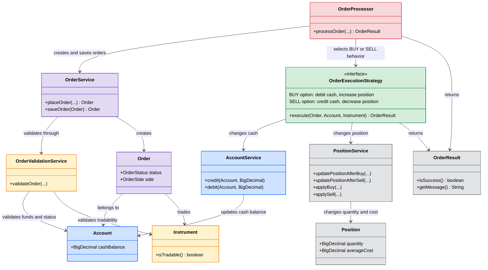

# Order Processing Logic – UML Class Diagram

This focused diagram shows the business classes involved in processing an order.
Persistence repositories, database implementations, and detailed model fields are
covered in the separate domain and persistence diagrams.

