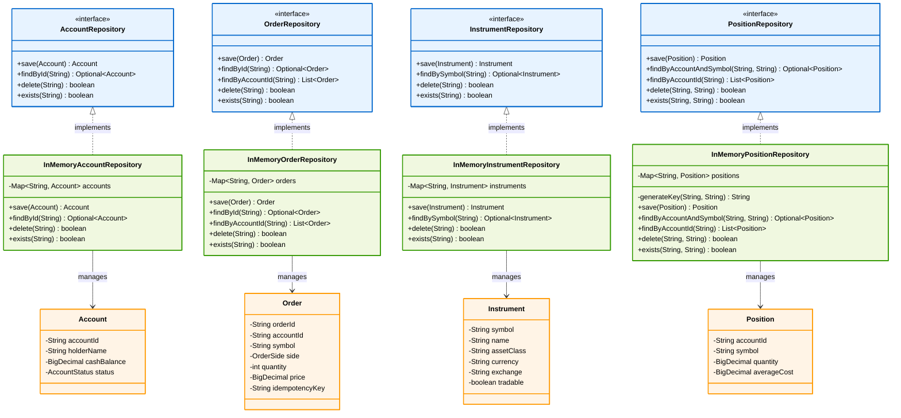

---

# Persistence Layer – UML Class Diagram

The persistence layer follows the **Repository Pattern**, abstracting data access logic behind interfaces. The architecture uses in-memory implementations for integration testing and is designed to support database implementations in the future.

