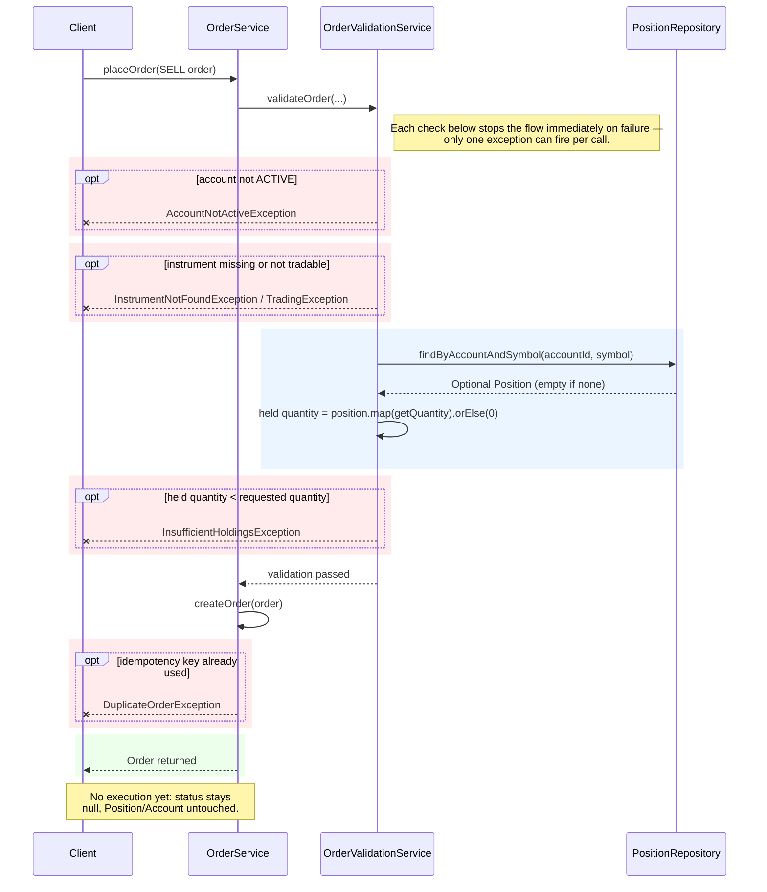

# Sell Order – UML Sequence Diagram

Traced from `OrderService.placeOrder` / `OrderValidationService` for a `SELL`
order. Reflects current code, not the intended full trade lifecycle — the order
gets validated and recorded, but nothing else happens yet (see note at the end).
`Client` is illustrative — nothing in the codebase actually calls this flow yet
(`Main.java` is still a placeholder).

