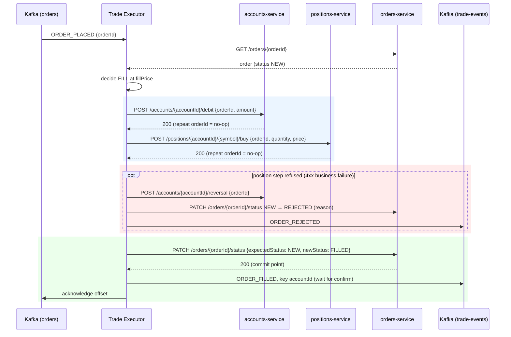
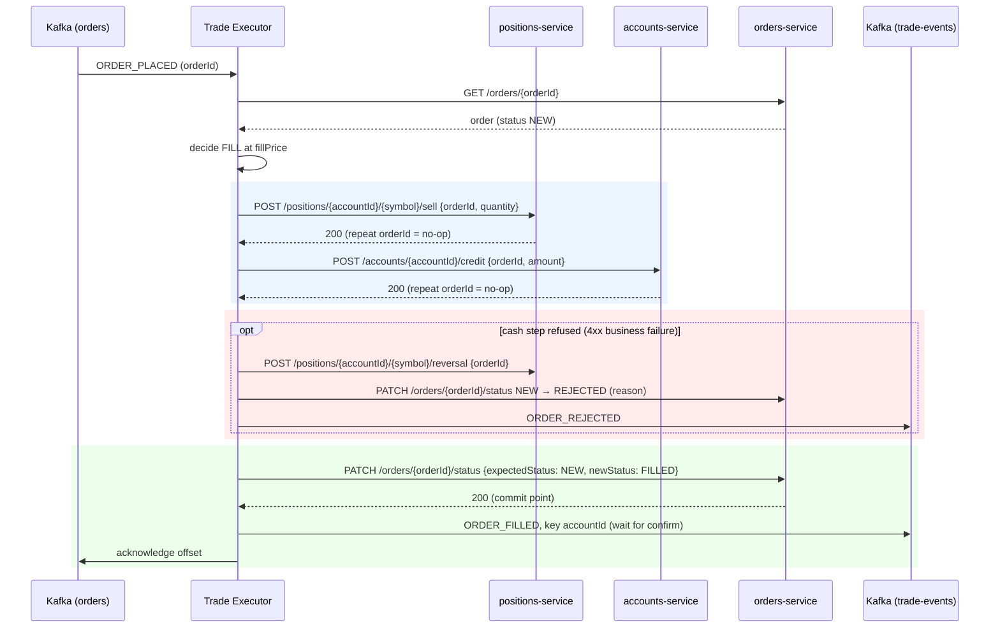

# Settlement Saga

Once the Trade Executor has decided FILL or REJECT for an order, settlement carries the decision out:
it moves the cash, updates the position, sets the order status, and publishes the outcome to `trade-events`.
The code is `SagaSettlementService` in trade-executor. It calls the idempotent endpoints.

## Why a saga instead of one transaction

"One database transaction with two guards": debit the cash, add the position
and set the status inside one `BEGIN ... COMMIT`, so either everything happens or nothing does.

We can't do that, because the data lives in three databases owned by three services:

| Data | Owner | Database |
|---|---|---|
| Cash balance | accounts-service | accounts-db |
| Holdings | positions-service | positions-db |
| Order status | orders-service | orders-db |

A database transaction can't span three databases, and letting one service write into another's database would
break the rule that each service owns its data. Two-phase commit across services is complex and fragile, and
nothing in our stack supports it.

A **saga** gets the same all-or-nothing result from a series of small steps:

1. **Each step is a local transaction** inside the service that owns the data.
2. **Each step is idempotent by `orderId`.** Repeating it with the same `orderId` does nothing the second time.
3. **The status change is guarded.** It only succeeds if the order is still `NEW`. This is the saga's commit point.
4. **Each step can be undone.** If a later step fails for good, earlier steps are reversed with a `REVERSAL`
   movement, which is also idempotent.

Together these mean the executor can crash at any point and simply rerun the whole saga when Kafka redelivers the
message. Steps that already happened are skipped, missing steps are completed, and nothing moves twice.

## The steps

| Decision | Step 1 | Step 2 | Commit point | Then |
|---|---|---|---|---|
| FILL + BUY | debit cash | add position | `NEW → FILLED` | publish `ORDER_FILLED` |
| FILL + SELL | reduce position | credit cash | `NEW → FILLED` | publish `ORDER_FILLED` |
| REJECT | nothing moves | nothing moves | `NEW → REJECTED` | publish `ORDER_REJECTED` |

The amount is `fillPrice × quantity`, rounded to 2 decimal places.

**Why BUY and SELL start from different sides.** Step 1 is always the one that can fail for a business reason:
a buyer may not have enough cash, and a seller may not have enough shares. Doing the step most likely to fail first
means a normal rejection moves nothing, so nothing needs undoing.

### BUY



### SELL



## Two kinds of failure

Every failure falls into one of two groups, and the saga handles them in opposite ways.

| Kind | Examples | Meaning | What the saga does |
|---|---|---|---|
| **Permanent** (business "no") | insufficient funds (400), inactive account (403), no such account (404), insufficient holdings (409), no position to sell (404) | Retrying will give the same answer | Reverse what moved, mark `REJECTED`, publish `ORDER_REJECTED` |
| **Temporary** | 5xx, timeout, service down, 401, Kafka publish not confirmed | Retrying might work | Throw. The offset isn't acknowledged, Kafka redelivers, and the saga reruns from the top |

The clients (`AccountsClient`, `PositionsClient`) turn permanent failures into a `SettlementRejectedException`.
Anything else is left alone so it reaches the Kafka error handler.

## Reversal rules

| Situation | Reverse | Final status | Publish |
|---|---|---|---|
| Step 1 refused | nothing (nothing moved) | `REJECTED` | `ORDER_REJECTED` |
| Step 2 refused | step 1 | `REJECTED` | `ORDER_REJECTED` |
| Status PATCH 409, order is `CANCELLED` | position, then cash | `CANCELLED` (unchanged) | nothing, because its already published `ORDER_CANCELLED` |
| Status PATCH 409, order is `FILLED` or `REJECTED` | nothing | unchanged | nothing (duplicate delivery) |
| Temporary failure anywhere | nothing | stays `NEW` | nothing; Kafka redelivers |

Reversals are always:

- **By `orderId`.** The owning service looks up what it moved for that order and undoes exactly that amount.
  The executor doesn't send an amount.
- **Idempotent.** Reversing twice does nothing the second time.
- **Safe when nothing moved.** Reversing an order with no movement is a no-op. That's why the cancellation path can
  reverse both steps without knowing which ones completed.
- **Independent of each other.** When both are reversed (a cancellation), the position goes first and then the cash,
  for BUY and SELL alike. The order doesn't change the outcome, because each reversal only undoes its own service's
  movement.

A reversal that fails isn't treated as a rejection. It throws, the order stays `NEW`, and Kafka redelivers so the
saga tries again.

## The commit point and the 409

The status change is the commit point: whichever call moves the order out of `NEW` first wins, and every other call
gets `409 Conflict`. orders-service does this with a single conditional update:

```sql
UPDATE orders SET order_status = :newStatus ... WHERE order_id = :orderId AND order_status = 'NEW'
```

Zero rows updated means `409`, and the response body carries the order's `currentStatus`. A 409 is never an error.
It tells the saga that someone else got there first:

- **`FILLED` or `REJECTED`**: an earlier delivery of this same message already finished. The steps it just repeated
  were no-ops, so there is nothing to do and nothing to publish.
- **`CANCELLED`**: the user cancelled while settlement was running, and cancellation won. The saga reverses
  both movements so the cash and position end where they started.

## Publish, then acknowledge

The order of the last three actions matters:

1. **Status change commits.** The trade is now official.
2. **Publish to `trade-events`.** The executor waits for Kafka to confirm the send (`send(...).get()`).
   The message is keyed by `accountId` and wrapped in the standard envelope (see [kafka-topics.md](kafka-topics.md)).
3. **Acknowledge the `orders` offset.** The listener uses `AckMode.MANUAL` and only acknowledges once `settle()`
   returns normally.

Publishing only after the commit means nobody hears about a trade that might still be undone. Acknowledging only
after the publish means a crash or failed publish leaves the message unacknowledged, so Kafka will deliver it again.

Payload of `ORDER_FILLED` / `ORDER_REJECTED`:

| Field | Filled | Rejected |
|---|---|---|
| `orderId`, `accountId`, `symbol`, `side`, `quantity` | set | set |
| `fillPrice` | the price used | `null` |
| `status` | `FILLED` | `REJECTED` |
| `reason` | `null` | why it was rejected |

## Crash walkthrough

Suppose the executor is killed after debiting the cash for a BUY, before adding the position.

| | First delivery | Executor killed | Redelivery |
|---|---|---|---|
| Order status | `NEW` | `NEW` | `NEW → FILLED` |
| Debit (orderId) | applied | | repeated → no-op |
| Add position (orderId) | | | applied |
| Publish | | | `ORDER_FILLED` |
| Offset | not acknowledged | | acknowledged |

End state: cash debited once, position added once, order `FILLED`, one event published.

## Endpoints used 

| Service | Call | Body |
|---|---|---|
| accounts | `POST /accounts/{accountId}/debit` | `{orderId, amount}` |
| accounts | `POST /accounts/{accountId}/credit` | `{orderId, amount}` |
| accounts | `POST /accounts/{accountId}/reversal` | `{orderId}` |
| positions | `POST /positions/{accountId}/{symbol}/buy` | `{orderId, quantity, price}` |
| positions | `POST /positions/{accountId}/{symbol}/sell` | `{orderId, quantity}` |
| positions | `POST /positions/{accountId}/{symbol}/reversal` | `{orderId}` |
| orders | `PATCH /orders/{orderId}/status` | `{expectedStatus: NEW, newStatus, reason}` → 200, or 409 with `currentStatus` |

## Known limitations

These are open questions for the team, not settled design:

- **A failed publish after the commit can lose the event.** If the status changes to `FILLED` and then the publish
  fails, the redelivered message finds the order no longer `NEW`. `OrderExecutionService` skips it, so
  `ORDER_FILLED` is never sent. Fixing it means republishing for orders already `FILLED`/`REJECTED`, which would
  require `trade-events` consumers to ignore duplicates by `orderId`.
- **Retries stop after about 15 seconds.** The Kafka error handler retries four times (1s, 2s, 4s, 8s) and then
  sends the message to `orders.DLT`. If a service is down longer than that mid-saga, the order stays `NEW` with a
  partial movement until someone replays it from the DLT.
- **The decision is recalculated on redelivery.** If the price moves between attempts, the published `fillPrice` can
  differ from the amount actually debited on the first attempt (the repeat debit is a no-op). In the worst case the
  decision flips from FILL to REJECT, leaving the first attempt's movement in place.
- **positions-service returns 409 for two things**: insufficient holdings and an optimistic-lock clash. The executor
  treats both as a rejection, so a lock clash rejects a sell that a retry would have filled.
