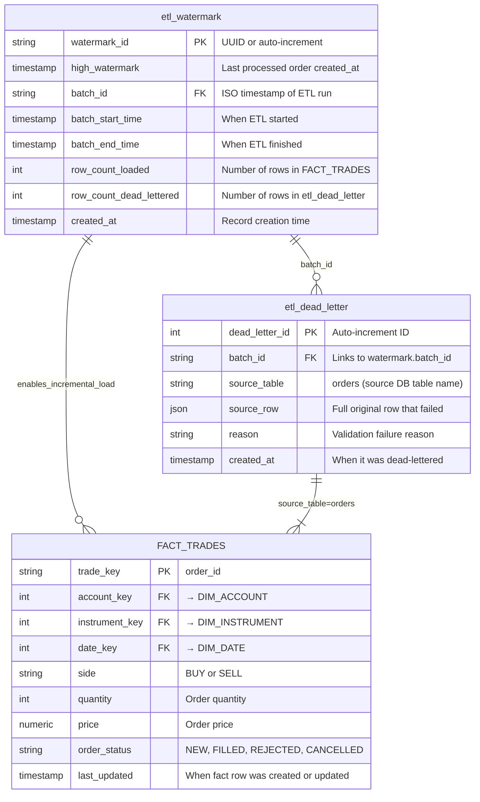
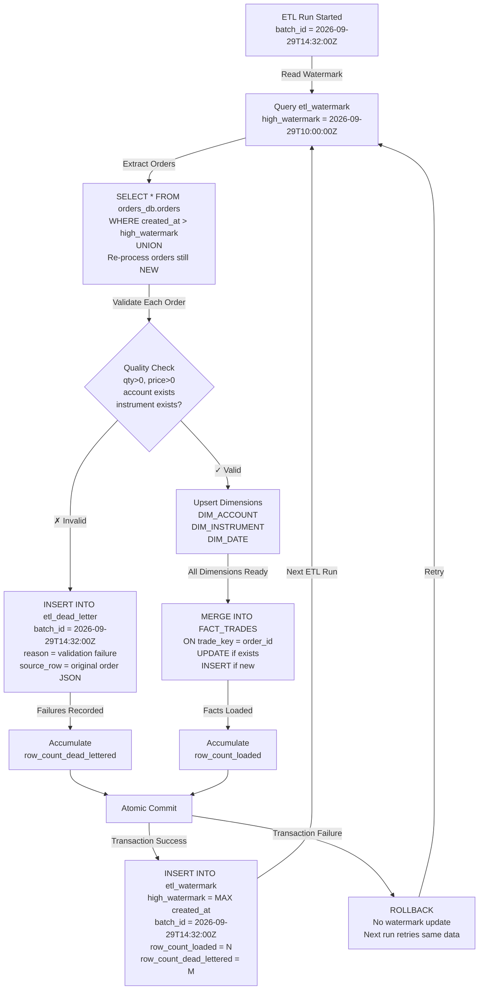

# ETL Infrastructure: Watermark & Dead-Letter Schema

This diagram shows how the **etl_watermark** and **etl_dead_letter** tables interact with the FACT_TRADES star schema to enable incremental loading with full audit trail.

## ER Diagram: Data Relationships



---

## ETL Process Flow: Watermark & Dead-Letter Lifecycle



---

## How Watermark Enables Incremental Loading

### Run 1 (First Time)
```
Watermark Table (empty initially)
→ Initialize to NOW() - 90 days
→ Extract orders created after that date
→ Load into FACT_TRADES
→ Update watermark: high_watermark = MAX(order.created_at) = 2026-09-28 15:00:00
```

### Run 2 (Next Day)
```
Read watermark: 2026-09-28 15:00:00
→ Extract ONLY orders created AFTER 2026-09-28 15:00:00
→ PLUS re-process orders still in NEW status (to catch status changes)
→ Update watermark: high_watermark = MAX(order.created_at) = 2026-09-29 14:30:00
```

### Run 3 (If Run 2 Failed)
```
Read watermark: 2026-09-28 15:00:00  (not updated because Run 2 rolled back)
→ Extract same orders as Run 2
→ Deduplicated by MERGE ON trade_key (no double-counting)
→ Update watermark: high_watermark = 2026-09-29 14:30:00
```

---

## How Dead-Letter Tables Audit Failures

### Scenario: Invalid Order

```
Order arrives in batch_id = 2026-09-29T14:32:00Z:
  order_id: ord-123
  account_id: ACC9999 (doesn't exist in accounts_db)
  quantity: 50
  price: 100.00

Validation fails:
  reason: "account not found: ACC9999"

Instead of silently skipping:
  INSERT INTO etl_dead_letter (
    batch_id,       → '2026-09-29T14:32:00Z'
    source_table,   → 'orders'
    source_row,     → {"order_id":"ord-123","account_id":"ACC9999",...}
    reason,         → 'account not found: ACC9999'
    created_at      → NOW()
  )

Result:
  - FACT_TRADES: NO change (row not inserted)
  - etl_dead_letter: row recorded for audit/replay
  - batch stats: row_count_dead_lettered incremented
  - Analytics team can query and investigate
```

---

## Batch Atomicity: All-or-Nothing

The entire ETL run is **one transaction**:

```sql
BEGIN TRANSACTION;

  -- Upsert all dimensions
  INSERT INTO analytics.DIM_ACCOUNT ... ON CONFLICT ... ;
  INSERT INTO analytics.DIM_INSTRUMENT ... ON CONFLICT ... ;
  INSERT INTO analytics.DIM_DATE ... ON CONFLICT ... ;
  
  -- Record dead-letters
  INSERT INTO analytics.etl_dead_letter (...) VALUES (...); -- for each invalid row
  
  -- Merge facts
  INSERT INTO analytics.FACT_TRADES ... ON CONFLICT ... ;
  
  -- Update watermark LAST (so it only advances if all above succeed)
  INSERT INTO analytics.etl_watermark (...) VALUES (...);

COMMIT;  -- All succeed together
-- OR ROLLBACK; -- All fail together (if any step errors)
```

**Why**: If the ETL crashes mid-run:
- ✅ Watermark doesn't advance
- ✅ Next run re-processes same orders
- ✅ MERGE ON trade_key deduplicates (no double-counting)
- ✅ All data consistent

---

## Query Patterns: Using Watermark & Dead-Letter

### Monitor ETL Runs
```sql
SELECT 
  batch_id,
  high_watermark,
  row_count_loaded,
  row_count_dead_lettered,
  batch_end_time - batch_start_time as duration
FROM analytics.etl_watermark
ORDER BY created_at DESC
LIMIT 10;
```

### Check Validation Failures
```sql
SELECT 
  batch_id,
  source_table,
  reason,
  COUNT(*) as failure_count
FROM analytics.etl_dead_letter
WHERE created_at > NOW() - INTERVAL '7 days'
GROUP BY batch_id, reason
ORDER BY failure_count DESC;
```

### Investigate Specific Failed Order
```sql
SELECT 
  dead_letter_id,
  source_row,
  reason,
  created_at
FROM analytics.etl_dead_letter
WHERE source_row ->> 'order_id' = 'ord-123';
```

### Verify Idempotency (Watermark Prevents Double-Counting)
```sql
-- Run ETL once: expect 100 trades
SELECT COUNT(*) FROM analytics.FACT_TRADES;
-- Output: 100

-- Manually re-run ETL with same watermark
-- (simulating a retry or re-trigger)
SELECT COUNT(*) FROM analytics.FACT_TRADES;
-- Output: 100 (unchanged, because watermark didn't advance)
```

---

## Integration with Star Schema

The watermark and dead-letter tables **support** the star schema operations:

| Table | Role | Purpose |
|-------|------|---------|
| `etl_watermark` | **Control** | Tracks which orders have been processed; enables next run to load only new data |
| `etl_dead_letter` | **Audit** | Records validation failures with full context (original row, reason, batch) |
| `FACT_TRADES` | **Analytics** | The actual trade events (fact rows with measures & dimensions) |
| `DIM_ACCOUNT`, `DIM_INSTRUMENT`, `DIM_DATE` | **Context** | Reference data for slicing and grouping facts |

---

## Acceptance Criteria: Infrastructure Validation

| Criterion | How It's Validated |
|-----------|-------------------|
| Watermark prevents re-loading old orders | `test_watermark_update_recorded`, `test_idempotency` |
| Dead-letter captures all validation failures | `test_invalid_quantity_zero`, `test_invalid_account_not_found`, etc. |
| Batch atomicity (all-or-nothing commit) | `test_commit_on_success`, `test_rollback_on_error` |
| Batch ID links watermark & dead-letter | `test_dead_letter_contains_full_row_as_json` includes batch_id |
| Order status changes detected & updated | `test_merge_facts_update_existing_row` (re-process NEW orders) |
| Connection retries don't lose data | `test_connection_retry_with_exponential_backoff` → no duplicate on retry |


