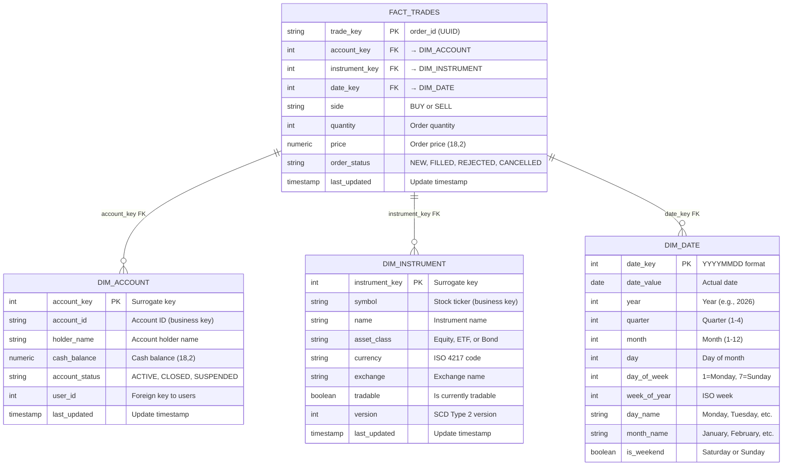

# FACT_TRADES Star Schema – ER Diagram

This diagram visualizes the dimensional data warehouse schema for trade analytics. The central FACT_TRADES table connects to three dimensions (Account, Instrument, Date) enabling efficient aggregation and slicing by account, instrument, and time

---

## Meaningful Analysis: What This Schema Enables

This data can be **joined and sliced** to provide meaningful insights into:

- **Instrument Analysis**: Which asset classes (Equity/ETF/Bond) drive the most volume? Which symbols are most traded?
- **Account Profitability**: Which accounts generate the highest transaction values? Who are the most active traders?
- **Buy-Sell Ratios**: Do certain accounts prefer buying over selling? Which instruments see more sell pressure?
- **Average Price Points**: Are certain accounts trading micro-caps vs blue chips? How does price correlate with volume?
- **Trending Patterns**: Seasonal trends (Q3 vs Q4), day-of-week effects (Mondays vs Fridays), weekend vs weekday trading
- **Order Status Flow**: What % of orders move from NEW → FILLED? How many are REJECTED or CANCELLED?
- **Cash Flow Correlation**: How does account cash_balance correlate with trading frequency?
- **Risk & Anomalies**: Spot accounts with unusual trading patterns, instrument concentration risk, dead-lettered validation failures