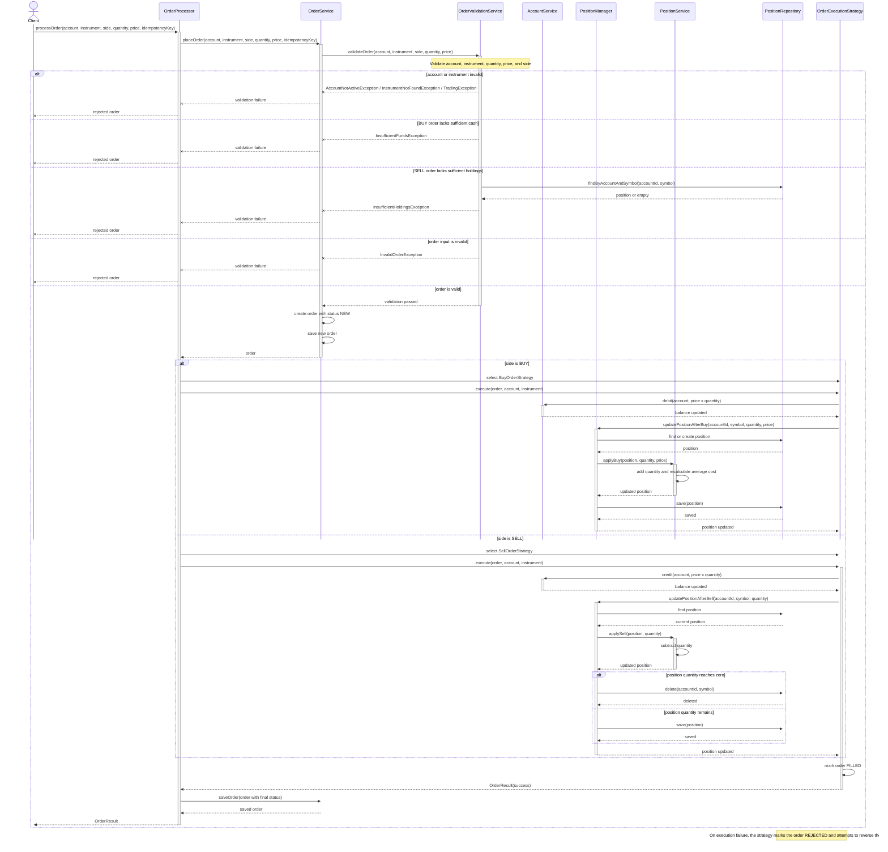

# Order Processing – Business Logic Sequence Diagram

This diagram traces the current order-processing flow through `OrderProcessor`,
`OrderService`, validation, account cash movement, position updates, and final
order status. It covers both BUY and SELL execution paths.

Validation occurs before execution. An invalid request stops at
`OrderService.placeOrder()` and no strategy is executed. The repositories shown
here are the current in-memory persistence boundaries; database transactions are
planned for the Spring Boot implementation.

