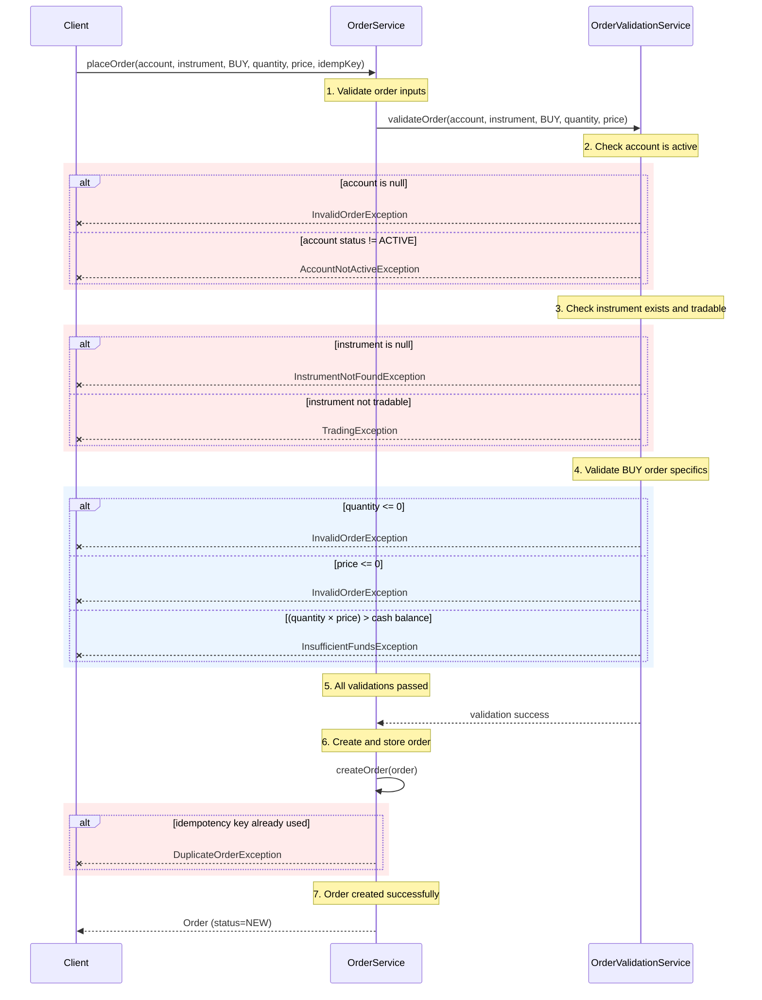

# Order Placement – UML Sequence Diagram

Comprehensive sequence diagram tracing `OrderService.placeOrder()` through all validation steps. Shows both **BUY** and **SELL** order flows with validation checkpoints and potential exception paths.

The flow validates in strict sequence — validation stops immediately on first failure. Only successful validation leads to order creation.

## BUY Order Flow

